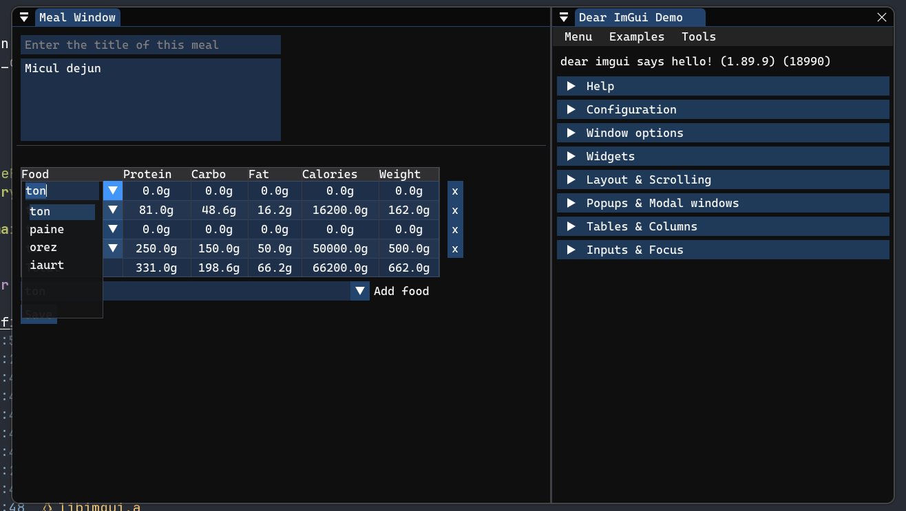

# Nutrition Tracker

> [!WARNING]
> **Work in progress** — this project is currently under active development.

This application helps with tracking meals.  
You can attach notes to meals, view graphs of your history over time,
and plan meals by nutritional value.



# Building

You will need `git`, `cmake`, and some sort of C/C++ tool chain.

```sh
git clone --recurse-submodules https://github.com/raugl/nutrition-tracker.git
cd nutrition-tracker
cmake . -B build
cmake --build build -j 16
```
